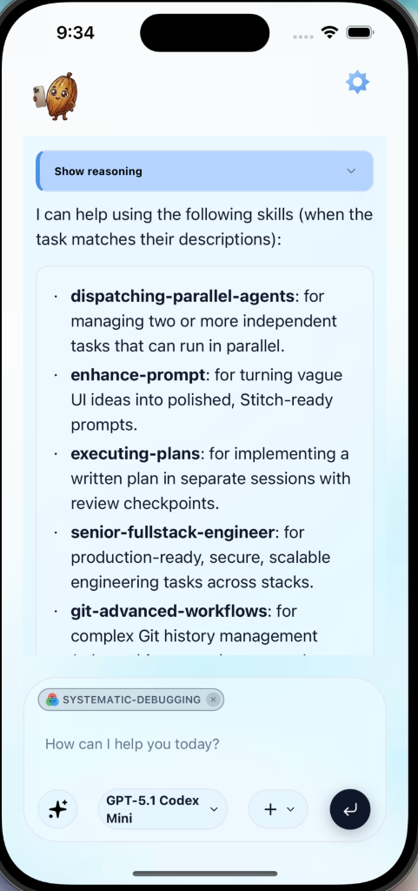

# Mobile Cocoa 🍫📱

Welcome to **Mobile Cocoa**! This repository is the mobile and backend ecosystem for "Vibe Coding Everywhere" – bringing advanced AI coding capabilities directly to your mobile device.

## 1. What Mobile Cocoa Does
Mobile Cocoa is a mobile-first intelligent coding assistant and development environment. It connects a sleek React Native (Expo) mobile interface to a powerful backend infrastructure. With Mobile Cocoa, you can:
- Discuss, design, and vibe-code software directly from your phone.
- Execute server-side operations, manage files, and interact with your development workspace seamlessly.
- Leverage LLM intelligence to build UI components, write full-stack code, and debug applications right from the palm of your hand.

<p align="center">
  
</p>
<p align="center"><em>Figure 1: Mobile Cocoa in action — skill-powered chat interface.</em></p>

### Why Mobile Cocoa is Great

**a. Skill-Driven Development & Low-Code Intelligence**
Mobile Cocoa utilizes a powerful skill-based architecture. It extends AI capabilities with predefined, specialized standard operating procedures ("skills" like UI/UX pro max, docker-expert, systematic-debugging, etc.). This makes it incredibly efficient at understanding complex tasks without requiring you to manually type a lot of boilerplate code from your phone.

**b. Unlimited Concurrent Sessions**
You can run as many parallel AI development sessions as possible. As long as you don't exceed your provider's rate limits/quotas, Mobile Cocoa scales with your ideas, allowing you to multi-task by spinning up distinct vibes for different components or servers simultaneously.

**c. Preview of Browser**
Tired of blind coding? Mobile Cocoa supports built-in browser previews, allowing you to see visual feedback of the web apps and UI components you and the AI are building in real-time, completely closing the feedback loop on mobile.

**d. Docker Integration**
Safety and consistency are paramount. Mobile Cocoa executes commands, sandboxes applications, and tests code within Docker containers. This means your local host environment is kept clean and safe, while providing a versatile and standardized Linux environment for the AI to work its magic.

## 2. Start Up Guide
Getting started with Mobile Cocoa is simple. The architecture is split between a Node.js backend server and an Expo mobile application.

### Prerequisites
- Node.js & npm/yarn installed
- Docker (optional, for secure sandboxed execution)
- Expo Go app on your phone (or an iOS/Android simulator)

### Step 1 — Install [Pi](https://github.com/badlogic/pi-mono) (CLI Agent Backend)

Mobile Cocoa uses **Pi** (`@mariozechner/pi-coding-agent`) as the underlying CLI agent that connects to LLM providers. Pi is a minimal AI coding harness that equips LLMs with `read`, `write`, `edit`, and `bash` tools for terminal-based coding tasks. The server runs Pi in `--mode rpc` (headless JSON-RPC) to programmatically control it.

**Install Pi globally:**
```bash
npm install -g @mariozechner/pi-coding-agent
```

This makes the `pi` command available system-wide.

**Authenticate with one or more providers** — run `pi` and follow the interactive prompts:

```bash
pi
```

Pi stores credentials in `~/.pi/agent/auth.json` (or `<workspace>/.pi/agent/auth.json`).

| Pi CLI Provider | What it covers |
|---|---|
| `anthropic` | Claude models (`claude-*`, `claude-sonnet`, `claude-opus`, etc.) |
| `google-gemini-cli` | Gemini 2.x / 3.x preview models (`gemini-3.1-pro-preview`, etc.) |
| `google-antigravity` | Gemini 3 Pro low/high/flash variants |
| `openai-codex` | Codex models (`gpt-5.3-codex`, `gpt-5.1-codex-mini`, etc.) |
| `openai` | Standard GPT models (`gpt-4o`, etc.) |

Mobile Cocoa automatically routes each request to the correct Pi provider based on the model selected in the app — this routing is configured in `config/pi.json` and requires no code changes.

### Step 2 — Configure the Server
Mobile Cocoa uses **JSON config files** instead of `.env` files. All configuration lives in the `config/` folder:

1. **Copy the example config:**
   ```bash
   cp config/server.example.json config/server.json
   ```
2. **Edit `config/server.json`** to customize your setup:
   ```json
   {
     "port": 3456,
     "defaultProvider": "gemini",
     "enableDockerManager": false,
     "funnelServerUrl": "http://YOUR_HOST:3456"
   }
   ```
   - `port` — the port the backend server runs on.
   - `defaultProvider` — which LLM provider to use by default (`"claude"`, `"gemini"`, or `"codex"`).
   - `enableDockerManager` — set to `true` to enable Docker sandboxing.
   - `funnelServerUrl` — set this to your machine's LAN IP or tunnel URL so the mobile app can reach the server.

You can also fine-tune the agent's behavior via `config/pi.json` (provider routing, default models, system prompts) and add/remove models in `config/models.json` — changes take effect without a restart.

### Step 3 — Install Dependencies
```bash
npm install
```

### Step 4 — Start the Backend Server
This powers the session registry, AI routing, Docker execution, and file system operations.
```bash
npm run dev
```

### Step 5 — Start the Mobile Application
In a separate terminal, launch the Expo dev server for the mobile client:
```bash
npm run dev:mobile
```

### Step 6 — Connect
- Scan the QR code generated by Expo with your phone's camera (iOS) or the Expo Go app (Android).
- Press **i** to open in an iOS Simulator, **a** for Android Emulator, or **r** to hard-reload.

> **Tip:** For local development, your phone and dev machine must be on the same Wi-Fi network. For remote access, see the Cloudflare tunnel method below.

### Cloudflare Tunnel (Remote Access)
To access Mobile Cocoa from outside your local network (e.g., when your phone is on cellular data), you can use Cloudflare Tunnel to expose your local server over a secure public URL.

**Prerequisites:**
- Install `cloudflared` — `brew install cloudflared` (macOS) or see [Cloudflare docs](https://developers.cloudflare.com/cloudflare-one/connections/connect-networks/get-started/) for other platforms.

**Steps:**

1. **Start everything with one command:**
   ```bash
   npm run dev:cloudflare
   ```
   This starts **three things** simultaneously:
   - The proxy server (port 9443)
   - The backend dev server (port 3456, with auto-restart)
   - A Cloudflare quick tunnel

2. **Wait for the tunnel URL** — after a few seconds you'll see a highlighted box in your terminal:
   ```
   ┏━━━━━━━━━━━━━━━━━━━━━━━━━━━━━━━━━━━━━━━━━━━━━━━━━━━━━━┓
   ┃ 🚀  EXPO TUNNEL COMMAND — Ready!                       ┃
   ┣━━━━━━━━━━━━━━━━━━━━━━━━━━━━━━━━━━━━━━━━━━━━━━━━━━━━━━┫
   ┃ Copy & run the command below in another terminal:      ┃
   ┗━━━━━━━━━━━━━━━━━━━━━━━━━━━━━━━━━━━━━━━━━━━━━━━━━━━━━━┛

     EXPO_PUBLIC_SERVER_URL=https://xxx.trycloudflare.com npm run dev:mobile:cloudflare
   ```

3. **Copy and run the printed command** in a separate terminal. The full command is printed on its own line below the box for easy copying.

4. **Scan the QR code** on your phone — your app will now connect through the secure Cloudflare tunnel.

> **Note:** Quick tunnels are free and require no Cloudflare account, but they have no uptime guarantee. A new URL is generated each time you start the tunnel.

### 📚 Documentation References
For deeper architectural insights, see the `docs/` folder:
- `docs/server-session-registry.md` — how AI sessions, streaming states, and the LRU cache are managed.
- `docs/server-utils.md` — core utilities powering the server infrastructure.

### Adding Skills (UI)

Use **Settings → Skill Configuration** to manage available agent skills:

- Open the screen and tap **+ Add Skill**.
- Switch to **Install from Catalog** to search curated skills (via `find-skills`) and install directly.
- Switch to **Create Skill** to scaffold a new local skill with slug name, category, and metadata.
- Newly installed/created skills are auto-enabled by default and can be disabled immediately if needed.
- Open a skill row to view extended metadata (source, path, version/ref, install time) and source file contents in the detail sheet.

For API-level behavior and payloads:
- `GET /api/skills/search` for discoverable skills
- `POST /api/skills/install` for catalog or direct GitHub install
- `POST /api/skills/create` for local skill creation

## 3. Tech Stack
- **Frontend / Mobile App:** React Native, Expo, TypeScript, TailwindCSS / Uniwind (for styling), Reanimated (for fluid animations).
- **Backend Server:** Node.js, Express, Server-Sent Events (SSE) for real-time streaming.
- **Infrastructure & Execution:** Docker containerization.
- **AI Integration:** Integration with advanced LLMs (like Claude/Gemini) through structured session routing and session registries.

## 🤝 Contributing
We welcome contributions of all kinds—bug fixes, features, or documentation improvements.

Please read our Contribution Guidelines before submitting a Pull Request or Issue.

### Quick Guide
1. Fork the repository
2. Create your feature branch (`git checkout -b feature/amazing-feature`)
3. Make your changes
4. Commit your changes (`git commit -m 'feat: add amazing feature'`)
   - 🔍 Pre-commit hooks will automatically check your code for errors
   - Run `npm run lint:fix` to auto-fix common issues
5. Push to the branch (`git push origin feature/amazing-feature`)
6. Open a Pull Request

### Code Quality
This project enforces code quality through automated pre-commit hooks:

- ✅ ESLint checks for unused imports/variables and coding standards
- ✅ TypeScript ensures type safety
- ✅ Commits are blocked if errors are found

See CONTRIBUTING.md for details.

Thank you to everyone who has contributed to Mobile Cocoa! 🙏

## 📄 License
This project is licensed under the MIT License. See the LICENSE file for details.

## 👥 Contributors
@YifanXu1999
