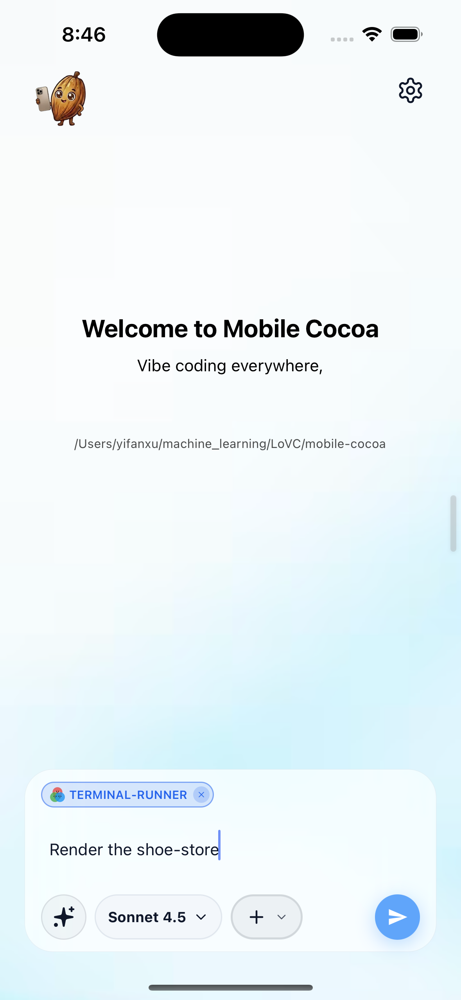
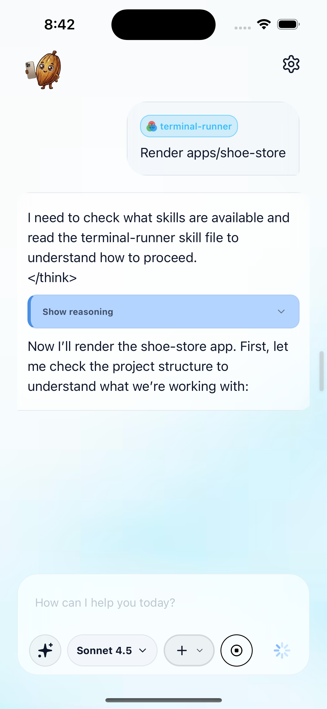
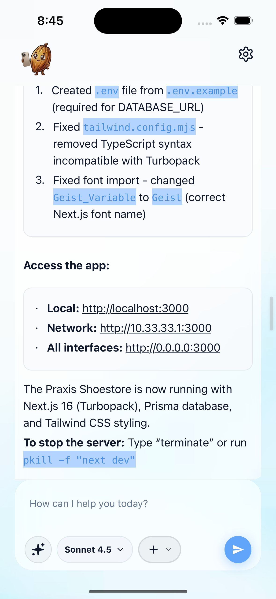
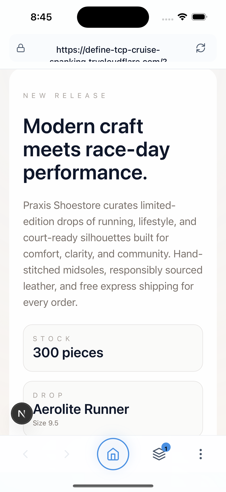
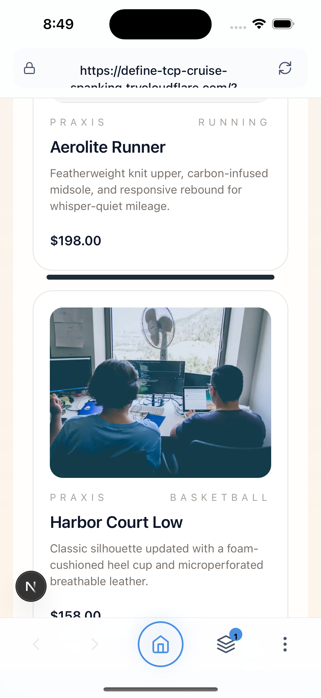

# Preview Your Project Frontend 🖥️

This guide shows you how to **render and preview** a project's frontend directly from your phone using Mobile Cocoa's built-in browser. No need to switch to a desktop — see your app come to life right in the palm of your hand.

> **Prerequisites:** You should have a project already scaffolded in your workspace (see [Start Your First Mobile App](start_your_first_mobile_app.md)).

---

## Step 1 — Enter the Render Command

From the Mobile Cocoa home screen, attach the **`terminal-runner`** skill and type your render command. For example:

> *"Render the shoe-store"*

The `terminal-runner` skill specializes in executing shell commands — it knows how to find your project, install dependencies, fix common config issues, and start your dev server automatically.

  

<em>Prompt with the terminal-runner skill attached, ready to render the project.</em>

---

## Step 2 — Press Enter & Let the AI Work

Hit the **send button** to submit. The AI begins by reasoning through the task — it reads the skill file, inspects the project structure, and plans the steps needed to get your app running.

You'll see a collapsible **"Show reasoning"** section and a response like:

> *"Now I'll render the shoe-store app. First, let me check the project structure to understand what we're working with."*

The AI autonomously explores your workspace and figures out the right commands to execute.

  

<em>The AI starts reasoning, reads skill files, and plans the render steps.</em>

---

## Step 3 — Wait for the Result

The AI handles everything to get your dev server running. In this example, it automatically:

1. Created a `.env` file from `.env.example` (required for `DATABASE_URL`)
2. Fixed `tailwind.config.mjs` — removed TypeScript syntax incompatible with Turbopack
3. Fixed font imports — changed `Geist_Variable` to `Geist` (correct Next.js font name)

Once the server is up, you'll see an **"Access the app"** section with clickable URLs:

- **Local:** `http://localhost:3000`
- **Network:** `http://10.33.33.1:3000`
- **All interfaces:** `http://0.0.0.0:3000`

> **Tip:** The AI also tells you how to stop the server later — type "terminate" or run `pkill -f "next dev"`.

  

<em>The AI fixed config issues and started the dev server with live URLs.</em>

---

## Step 4 — Click the URL to Open the Preview

Tap one of the **clickable URL links** in the AI's response. Mobile Cocoa opens its **built-in browser** — no need to leave the app.

The browser loads your project's frontend through the Cloudflare tunnel, showing the live rendered page. In this example, you'll see the **Praxis Shoestore** landing page with:

- A **"NEW RELEASE"** hero section
- The headline: *"Modern craft meets race-day performance."*
- Store description, stock counts, and the latest product drop

The browser includes navigation controls (back/forward arrows), a home button, and a layers icon at the bottom.

  

<em>The project frontend rendered live in Mobile Cocoa's built-in browser.</em>

---

## Step 5 — Browse the Full Page

Scroll down to explore the rest of your rendered app. The built-in browser is fully interactive — you can scroll, tap links, and navigate just like a regular browser.

In the shoe-store example, scrolling reveals:

- **Product cards** with images, names, descriptions, and prices (e.g. *Aerolite Runner — $198.00*)
- **Category labels** (Running, Basketball, etc.)
- Rich product imagery and a polished layout — all generated by the AI

  

<em>Scrolling through the live product catalog in the built-in browser preview.</em>

---

## What Just Happened?

You've just completed a full **code → render → preview** loop entirely from your phone:

1. ✅ Told the AI to render your project with a single prompt
2. ✅ The AI auto-fixed config issues and started the dev server
3. ✅ Clicked a URL to open the live preview in the built-in browser
4. ✅ Browsed the fully rendered frontend — product pages, images, and all

This closed-loop workflow means you can **iterate rapidly**: if something doesn't look right, go back to the chat, describe what to change, and preview again.

---

## Tips & Tricks

- **🔄 Refresh** — Tap the reload icon (↻) in the browser toolbar to see updated changes
- **📱 Responsive** — The built-in browser renders at mobile width, giving you an accurate preview of how your app looks on phones
- **🔗 Cloudflare URLs** — The URL bar shows your Cloudflare tunnel domain, meaning the preview works even when you're on a different network
- **💬 Iterate** — Go back to the chat view and ask the AI to tweak styles, fix bugs, or add features — then refresh the preview

> **Happy previewing! 🍫📱**
