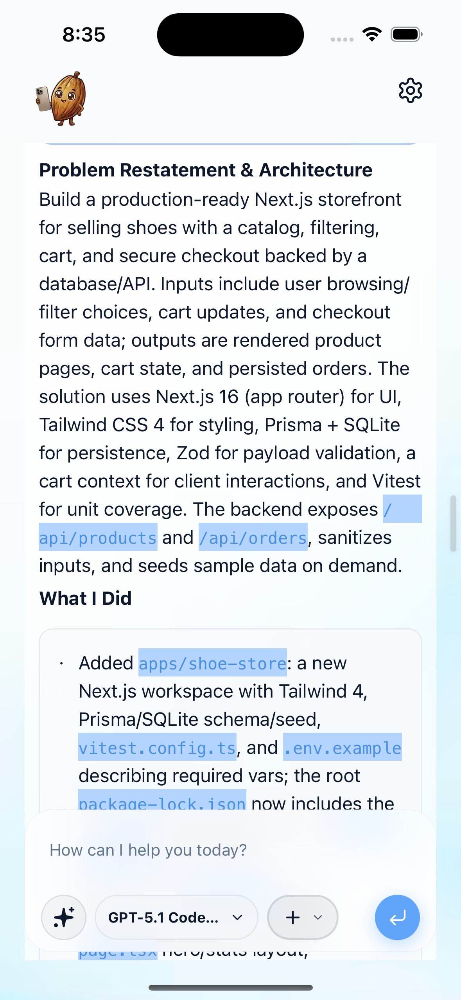
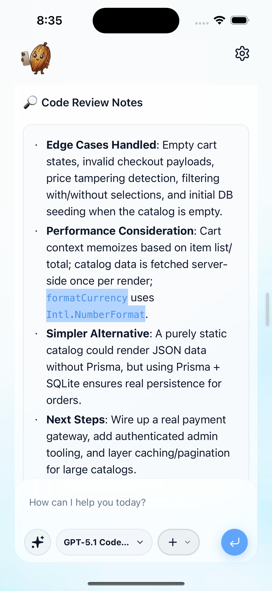

# Start Your First Mobile App 🚀

This guide walks you through building your very first application using Mobile Cocoa — from opening the app to getting a fully scaffolded, production-ready project — all from your phone.

> **Prerequisites:** Make sure you've completed the [Connect to Mobile Guide](../connect_to_mobile_guide.md) and have the app running on your device.

---

## Step 1 — Land on the Home Page

When the app finishes loading, you'll be greeted by the **Mobile Cocoa welcome screen**. This is your home base for all vibe-coding sessions.

From here you can see:
- The **workspace path** currently connected (shown below the welcome message)
- The **chat input** at the bottom with a prompt field: *"How can I help you today?"*
- The **model selector** (e.g. `GPT-5.1 Code…`, `Opus 4.5`) to choose your preferred LLM
- A **skills button** (✦ icon) to access the Skill Hub

  

<em>The Mobile Cocoa welcome screen with chat input and model selector.</em>

---

## Step 2 — Select a Skill

Tap the **✦ (skills) button** at the bottom-left of the chat input to open the **Skill Hub**. Skills are specialized AI personas that dramatically improve the quality of code generation for specific tasks.

Browse and select the skill that matches your goal:
- **`cloudflare-deploy`** — for deploying to Cloudflare
- **`senior-fullstack-engineer`** — for full-stack web application development
- **`refactor`** — for refactoring existing codebases
- **`terminal-runner`** — for terminal/shell operations

Tap a skill to attach it to your prompt. The selected skill will appear as a **tag** in the chat input area.

  

<em>The Skill Hub panel with Development skills listed.</em>

---

## Step 3 — Write Your Query

With a skill selected, type your request into the chat input. Be clear and descriptive about what you want to build.

For example, with the **`senior-fullstack-engineer`** skill attached:

> *"Design a full stack e-commerce project in Nextjs for selling shoes, do not ask and kindly proceed."*

Notice the skill tag (e.g. `🧑‍💻 SENIOR-FULLSTACK-ENGINEER`) pinned above your message — this ensures the AI operates with the right expertise and standard operating procedures for your task.

> **Tip:** Adding **"do not ask and kindly proceed"** tells the AI to skip clarifying questions and start building immediately — great for when you have a clear vision.

  

<em>A prompt ready to submit, with the senior-fullstack-engineer skill attached.</em>

---

## Step 4 — Press Enter & Watch the AI Work

Hit the **send button** (blue arrow) to submit your prompt. The AI immediately begins working — you'll see a live **Reasoning** panel that shows:

- 🖊️ **"Generating code…"** status indicator
- File reads (e.g. `read SKILL.md`, `read package.json`)
- Shell **commands** being executed (e.g. `ls -la`, `node --version`, `ls apps/mobile`)
- The AI exploring and understanding your workspace structure

The AI autonomously reads skill files, inspects your project layout, runs system checks, and begins scaffolding your application — all streamed in real-time to your phone.

  

<em>The AI is actively reading files, running commands, and generating your project.</em>

---

## Step 5 — Get Your Result

Once the AI finishes, it provides a comprehensive summary of everything it built. The response typically includes:

### Architecture & Implementation Details

The AI presents a **Problem Restatement & Architecture** section that outlines:
- The tech stack chosen (e.g. Next.js 16, Tailwind CSS 4, Prisma + SQLite, Zod, Vitest)
- API endpoints created (e.g. `/api/products`, `/api/orders`)
- A **"What I Did"** breakdown listing every file and directory created

  

<em>The AI's architecture overview and list of created files.</em>

### Code Review Notes

The AI also includes **Code Review Notes** covering:
- **Edge Cases Handled** — e.g. empty cart states, invalid payloads, price tampering detection
- **Performance Considerations** — e.g. memoization strategies, server-side fetching
- **Simpler Alternatives** — when applicable, lighter approaches are suggested
- **Next Steps** — recommendations for what to build next (payment gateways, admin tooling, etc.)

  

<em>Code review notes with edge cases, performance tips, and next steps.</em>

---

## What Just Happened?

In under **10 minutes**, from your phone, you've:

1. ✅ Opened Mobile Cocoa and connected to your workspace
2. ✅ Selected a specialized AI skill for full-stack development
3. ✅ Described what you wanted to build in plain English
4. ✅ Watched the AI autonomously scaffold your entire project
5. ✅ Received a production-ready codebase with architecture docs and code review

Your complete e-commerce store — with catalog, filtering, cart, checkout, database, API routes, and tests — is now sitting in your workspace, ready to run.

---

## What's Next?

- **🔍 Preview your app** — Use Mobile Cocoa's built-in browser preview to see what the AI built
- **💬 Iterate** — Send follow-up messages to refine, add features, or fix issues
- **🔀 Start new sessions** — Spin up parallel sessions for different parts of your project
- **🐳 Use Docker** — Run your app in a sandboxed Docker container for safety

> **Happy vibe coding! 🍫📱**
